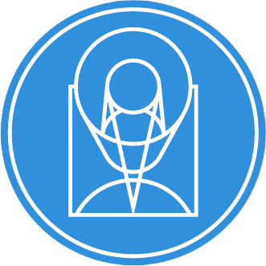

# stsci.imagestats

`stsci.imagestats` is a package designed to compute various statistics on image data using sigma-clipping iterations.
It is designed to replicate core behaviour of the `IRAF`\ 's `imstatistics` task.
